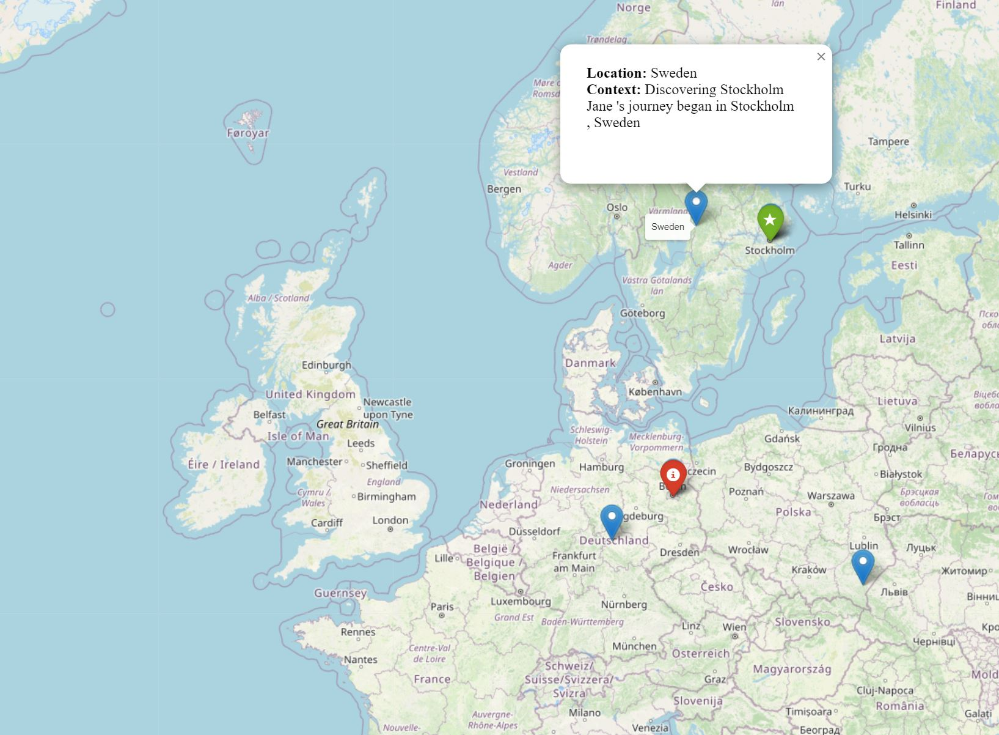

# MePlaPy

**MePlaPy** stands for "Mentioned Places Python." It is a Python package designed to extract, geolocate, and visualize places mentioned in various document formats, such as PDFs, text files, and CSVs. It can help you in OSINT investigations by analyzing documents and creating a spatial understanding of the places mentioned.



## Installation

To install MePlaPy, you can clone the repository from GitHub. Make sure you have `git` installed on your system.

```bash
git clone https://github.com/swes92/meplapy.git
cd meplapy
pip install -r requirements.txt
```

## Usage

You can run the command-line interface (CLI) of MePlaPy using the following command:

```bash
python cli.py [input_file]
```

### Parameters

- `input_file`: Path to the input document (PDF, TXT, or CSV) that you want to process.

- `--ner`: Use this flag to specify that you want to extract Named Entity Recognition (NER) locations from the text.
- `--ip`: Use this flag to specify that you want to extract and geolocate IP addresses from the text.
- `--co`: Use this flag to plot coordinates found in the text on the map.

## Example

To run MePlaPy on a text file while extracting NER and geolocating IP addresses, use the following command:

```bash
python cli.py example.txt --ner --ip
```

## Output

MePlaPy will generate the following outputs:
- A map file (`.html`) showing the geolocated NER locations and/or coordinates.
- A CSV file containing the geocoded locations and their context.
- A CSV file with information about the geolocated IP addresses.

## License

MePlaPy is licensed under the MIT License. See the `LICENSE` file for more details.

## Known Issues / Caveats

As of now, MePlaPy can only identify lat/long coordinates, MGRS or UTM are not implemented yet.
For the extractions of named entities, false positives do happen due to the way places are named on Open Street Map. Also, there are cities with weird names... ;)

## Acknowledgments

This project leverages several Python libraries for text extraction, geolocation, and mapping. For a complete list of libraries and their purposes, check the `requirements.txt` file.

## Disclaimer

The information and tools provided by MePlaPy are for educational and informational purposes only. While every effort has been made to ensure the accuracy of the data processed, the creators of MePlaPy make no guarantees about the completeness, reliability, or suitability of the information extracted or geolocated. Users are responsible for verifying any critical information obtained through this tool and using it in accordance with applicable laws and regulations. The developers are not liable for any damages or issues that may arise from the use of this software.

---

Feel free to contribute or suggest improvements!
